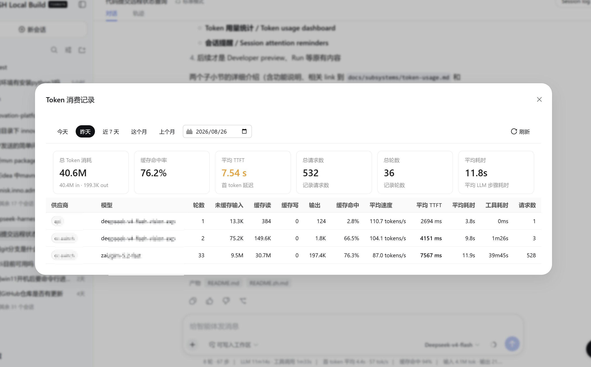
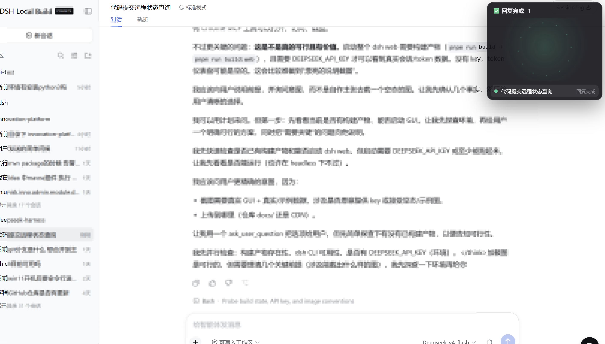

# DeepSeek Harness

[English](README.md) | 中文

DeepSeek Harness（`dsh`）是由 [DeepSeek AI](https://deepseek.com) 开发的开源 agent harness（智能体框架）。

它构建于**一切皆插件**的架构之上，由 [Cordis](https://github.com/cordiverse/cordis) 驱动，其设计参见论文 [_A Programming Paradigm for Spatiotemporal Composability_](https://arxiv.org/abs/2608.25512)。

文档：[https://deepseek-harness.github.io/deepseek-harness/](https://deepseek-harness.github.io/deepseek-harness/)

> **在官方版本之上新增** —— 本仓库在标准 DeepSeek Harness 之外额外提供两项能力：**Token 用量统计**与**会话提醒**。

## 新增功能

本仓库在官方 DeepSeek Harness 之上新增了两项能力。

### Token 用量统计

`@deepseek-ai/dsh-token-usage` 将每次模型调用的提供商用量落库到 SQLite，并按 `(provider, model)` 聚合成每日摘要——包括未命中缓存的输入、缓存读取、缓存写入、输出四类 token 用量，以及首 token 时延与耗时均值。内置 Web 仪表盘（`packages/bundle/token-usage-dashboard`）在 Web GUI 中展示这些跨会话统计。详见 [token-usage 子系统文档](docs/subsystems/token-usage.zh.md)。



### 会话提醒

当某个后台会话正在等待用户（待审批 / 待计划审阅 / 待提问等 `pendingInteraction`，或已完成但尚未打开的 AI 回复）时，Web GUI 右上角会浮现一个浮动覆盖层。它会为标签页标题加上 `(N)` 前缀，并根据当前最高优先级的提醒种类播放四套不同的 Canvas2D 动画之一，让用户一眼分辨是哪种提醒。该插件在独立仓库 [`dsh-session-attention`](https://github.com/my-dsh/dsh-session-attention) 中开发；安装方式见[社区插件指南](docs/user/guide/community-plugins.zh.md)。



## 开发者预览

DeepSeek Harness 处于 _开发者预览_ 阶段，正在快速迭代。**未来将出现破坏兼容性的变更。**

运行本项目前，请阅读[安全说明](SAFETY.zh.md)。

<a id="run"></a>

## 运行

### 通过 `npm` 运行

安装 `Node.js`，然后运行：

```sh
npx @deepseek-ai/dsh web
```

该命令默认会在 `http://127.0.0.1:3080` 启动 Web UI，本机启动时还会用默认浏览器打开页面。通过 SSH 启动时只打印宿主机 URL，因为本地转发地址由 SSH 客户端或编辑器持有。传入 `--no-open` 可仅运行服务器而不打开浏览器。详见 [Web UI 指南](docs/user/guide/index.zh.md)。

<a id="run-from-source"></a>

### 从源码运行

如需从仓库源码运行：

```sh
git clone https://github.com/deepseek-ai/deepseek-harness.git
cd deepseek-harness
pnpm install
pnpm run build
pnpm dsh web
```

`pnpm run build` 会准备仓库产物。`pnpm dsh web` 会直接使用这些已构建产物，不会重新构建。

## 社区与支持

- 通过 [GitHub Discussions](https://github.com/deepseek-ai/deepseek-harness/discussions) 提交反馈或 bug 报告。
- 为你的插件仓库添加 [`dsh-plugin`](https://github.com/topics/dsh-plugin) 话题，便于被发现。
- 欢迎加入 DeepSeek Harness 企微群：扫码添加企微小助手并填写入群问卷，完成后小助手会邀请你入群。

<table>
  <thead>
    <tr>
      <th align="center">企微小助手</th>
      <th align="center">入群问卷</th>
      <th align="center">微信公众号</th>
    </tr>
  </thead>
  <tbody>
    <tr>
      <td align="center"></td>
      <td align="center"><a href="https://trtgsjkv6r.feishu.cn/share/base/form/shrcnIt5twSVdLGD52KJBckGCgg"></a></td>
      <td align="center"></td>
    </tr>
  </tbody>
</table>

## 参与贡献

参见 [CONTRIBUTING.md](CONTRIBUTING.zh.md)。

## 开发

请先阅读[开发指南](docs/development.zh.md)与[架构文档](docs/architecture.zh.md)。

面向 agent：请遵循 [AGENTS.md](AGENTS.md)。

## 许可证

[MIT](LICENSE)

第三方依赖及其许可证见 [THIRD_PARTY_NOTICES.md](THIRD_PARTY_NOTICES.md)。
